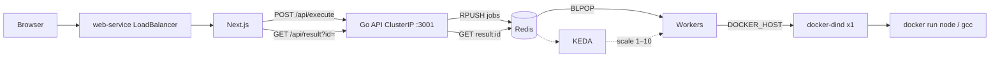

# Code Run

Browser playground for **JavaScript** and **C++**. The UI is Next.js (**CODE RUN**). Code is queued in Redis, run by Go workers in Docker, and results are polled from the UI.

On Kubernetes, only the web app is public (`LoadBalancer`). The judge, Redis, and Docker-in-Docker stay on **ClusterIP**.

## Architecture



| Piece | What it does |
| --- | --- |
| Next.js | Editor + terminal UI. Proxies `/api/execute` and `/api/result` to the judge (`JUDGE_URL`). |
| Go API (`ROLE=api`) | `POST /execute` validates JS/C++, `RPUSH`es `{id, language, code}` onto Redis list `jobs`. `GET /result?id=` reads `result:<id>` (HTTP 202 if missing). |
| Redis | Queue (`jobs`) and results (`result:<id>`, 1h TTL). |
| Workers (`ROLE=worker`) | `BLPOP jobs`, `docker run` (5s JS / 10s C++). Writes `result:<id>`. |
| KEDA `worker-scaler` | Redis list length / `listLength: 2`, min 1 max 10 workers. Scale-down to 1 uses the default HPA window (~5 minutes). |
| docker-dind | **One** privileged Docker engine. All sandboxes run here. Do not scale this Deployment. |

KEDA adds **worker pods**. It does not add Docker engines. Sandbox CPU stays on the node that runs `docker-dind`.

The browser does not call workers. After queueing, the client polls `/api/result?id=` every 400ms (30s cap).

## Local

Needs Docker (mini-judge mounts `/var/run/docker.sock`).

```bash
docker compose up --build
```

- UI: <http://localhost:3000>
- Judge: <http://localhost:3001>

Or run Redis, `go run .` in `mini-judge/` (`ROLE=all`, `REDIS_ADDR=localhost:6379`), and `npm run dev` in `web/` with `JUDGE_URL=http://localhost:3001`.

## Kubernetes

Manifests in `k8/`:

- `web-deploy.yml` — UI, LoadBalancer `:80` → container `3000`
- `backend-deploy.yml` — Redis + API
- `worker-deploy.yml` — workers, `DOCKER_HOST=tcp://docker-dind:2375`
- `docker-dind.yml` — single DinD, ClusterIP `2375`
- `keda-worker.yml` — ScaledObject (install [KEDA](https://keda.sh) first)

Images: `beyondhuman6969/code-run-web:0.3`, `beyondhuman6969/mini-judge:0.2` (linux/amd64).

```bash
kubectl apply -f k8/backend-deploy.yml
kubectl apply -f k8/docker-dind.yml
kubectl apply -f k8/worker-deploy.yml
kubectl apply -f k8/web-deploy.yml
kubectl apply -f k8/keda-worker.yml
```

Pre-pull compiler images inside DinD or the first C++ job pays for `docker pull` inside the 10s timeout:

```bash
kubectl exec deploy/docker-dind -- docker pull gcc:13
kubectl exec deploy/docker-dind -- docker pull node:20-alpine
```

## Demo: worker scale-up

1. Confirm one worker and an empty queue:

   ```bash
   kubectl get deploy worker-deployment
   kubectl exec deploy/redis -- redis-cli LLEN jobs
   ```

2. Watch pods:

   ```bash
   watch -n 1 kubectl get pods -l app=worker-app
   ```

3. Flood jobs (set `BASE` to the web LoadBalancer URL; do not commit that IP):

   ```bash
   BASE=http://YOUR_LB ./scripts/flood-cpp.sh 50
   ```

   Jobs `sleep(8)` then print `2`, so they finish before the 10s kill. Check `LLEN jobs` and `kubectl get hpa` while the flood is in flight.

4. Afterward, extra workers drop toward 1 about five minutes after the list is empty.

A screen recording of this flow belongs next to the README if you host it (the `.mov` is large; do not commit it to git).

## Limits

- C++/JS that run longer than the worker timeout end with `signal: killed`.
- Nested containers use `--network none`, `--memory 128m`, read-only root + `/tmp` tmpfs.
- HTTPS needs a domain (or Ingress + cert-manager). The LoadBalancer is HTTP only.
